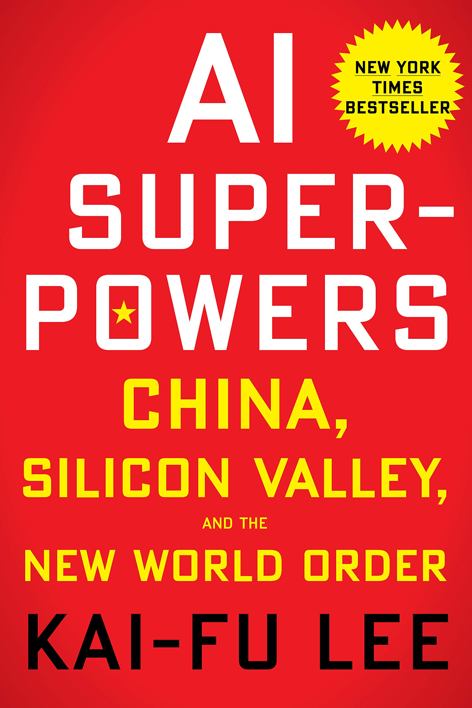

# Overview
## MISY331: Machine Learning for Business

> "Talk is cheap. Show me the code." - Linus Torvalds

This course introduces the basic concepts and techniques of machine learning and covers most commonly used models for predictive analytics. The end-to-end workflow for typical machine learning projects is illustrated via multiple business programming cases and Kaggle competitions. If time permits, deep learning techniques are also introduced. This course is programming intensive using Python 3 and popular packages, such as Jupyter, Numbpy, Pandas, Matplotlib, Seaborn, and Scikit-Learn.

**Key Topics**:

- Machine Learning Overview
- Toolkit Bootcamp (python, anaconda, jupyter, numpy, pandas, matplotlib, seanborn, scikit-Learn)
- Exploratory Data Analysis (EDA)
- Data Preprocessing (missing data, outliers, feature encoding, pipeline, etc.)
- Model Training, Evaluation, and Tuning
- Classification (Decision Tree, Logistic Regression)
- Regression (Linear Regression, Gradient Descent, SVM)
- Ensemble Learning (Random Forest, Gradient Boosting)
- Clustering (K-Means)
- Dimensionality Reduction
- Data Science App (Streamlit)

# Instructor

Professor Harry J. Wang: check out my website at [harrywang.me](http://harrywang.me/)

# Books

We refer to the following technical books in this course:

- (Free) [Python Data Science Handbook](https://jakevdp.github.io/PythonDataScienceHandbook/) by Jake VanderPlas

- [Hands-On Machine Learning with Scikit-Learn, Keras, and TensorFlow, 2nd Edition](https://www.oreilly.com/library/view/hands-on-machine-learning/9781492032632/) by Aurélien Géron

- (Free) [Mathematics for Machine Learning](https://mml-book.github.io/) by Marc Peter Deisenroth, A. Aldo Faisal, and Cheng Soon Ong. I re-created the Table of Symbols in Latex using Jupyter Notebook, which you can access at [Google Colab](https://colab.research.google.com/drive/15cQSy8AvU_0ChtNfYaW_Wqfj_dgPv_Lq) and [Overleaf](https://www.overleaf.com/read/mnzgdyrsjfsk).

I also recommend reading the following business books:

- [Prediction Machines: The Simple Economics of Artificial Intelligence](https://www.predictionmachines.ai/)  by Ajay Agrawal, Joshua Gans, and Avi Goldfarb

- [AI Superpowers: China, Silicon Valley, And The New World Order](https://www.amazon.com/AI-Superpowers-China-Silicon-Valley/dp/132854639X) by Kai-Fu Lee

- [A Human's Guide to Machine Intelligence: How Algorithms Are Shaping Our Lives and How We Can Stay in Control](https://www.amazon.com/Humans-Guide-Machine-Intelligence-Algorithms/dp/0525560882/) by Kartik Hosanagar

[Back to Top](#misy331-machine-learning-for-business)
